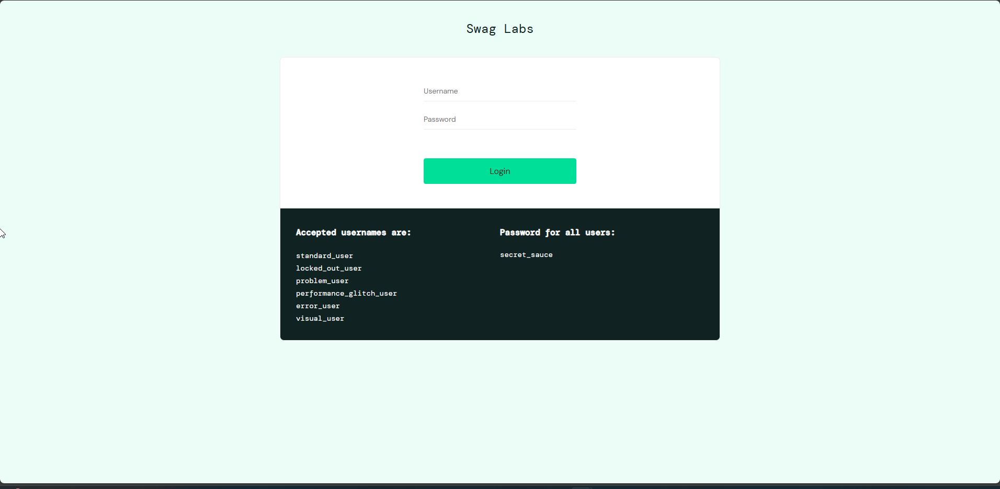
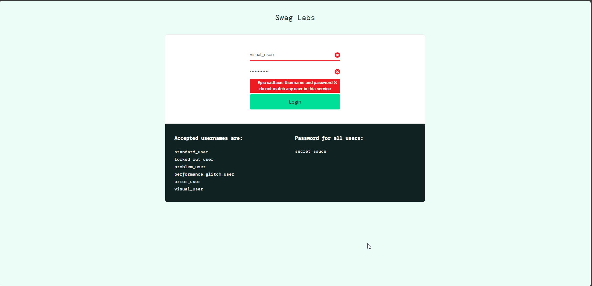

# Casos de Teste – Tela de Login (saucedemo)

## 1. Cenário: Exibição dos elementos da tela de login
**Dado** que estou na tela de login  
**Então** devo ver um campo para inserção do nome de usuário  
**E** devo ver um campo para inserção da senha  
**E** devo ver um botão com o texto "Login"

**Resultado obtido:**  
✅ Todos os elementos foram exibidos corretamente.

**Evidência** :

---

## 2. Cenário: Login com credenciais válidas
**Dado** que estou na tela de login  
**Quando** insiro um nome de usuário válido  
**E** insiro uma senha válida  
**E** clico no botão "Login"  
**Então** devo ser redirecionado para a página de produtos

**Resultado obtido:**  
✅ Login realizado com sucesso.

**Eviência** : 
[Vídeo demonstrativo](./evidencias/login-com-sucesso.mp4)

---

## 3. Cenário: Login com credenciais inválidas
**Dado** que estou na tela de login  
**Quando** insiro um nome de usuário inválido  
**E** insiro uma senha inválida  
**E** clico no botão "Login"  
**Então** devo ver uma mensagem de erro informando "Nome de usuário e senha não correspondem a nenhum usuário neste serviço". 

**Resultado obtido:**  
✅ Mensagem de erro exibida com sucesso.

**Evidência** :

